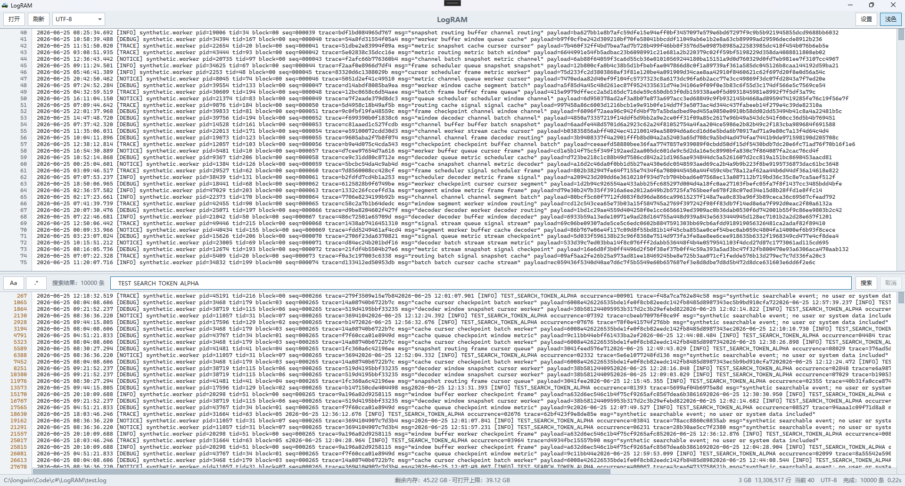
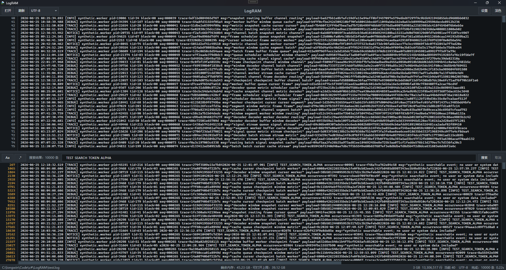

<div align="center">


# LogRAM

**全内存超大日志文件查看器**

简体中文 | [English](README.en.md)

</div>

LogRAM = **Log** + **RAM**。它把整个日志文件一次性载入内存，再配合字节级 / SIMD / 多核搜索引擎和虚拟化渲染，让你能够**秒开、流畅滚动、瞬时搜索**那些记事本和普通编辑器根本打不开的几 GB 乃至几十 GB 的日志文件。

<div align="center">




</div>

---

## 功能特性

- **超大文件**：启动时检测当前可用内存，单文件最大可打开到启动时剩余内存的 **80%**（底部状态栏会实时显示当前剩余内存与可打开上限）。
- **极速搜索**：纯文本走字节级搜索（无需逐行解码），ASCII 忽略大小写使用 SIMD 向量化，大文件自动多核并行。
- **流式结果**：边搜边出结果，随时可取消，并实时显示进度与命中数。
- **正则 / 大小写**：支持正则表达式与区分大小写开关。
- **高级搜索**：通过「包含任一 / 排除任一」组合多个关键词，命中条件为「命中任一包含词（OR）且不含任何排除词（NOT）」；可在弹窗中可视化编辑，也可直接输入 `in(a,b);notin(c,d)` 语法。
- **点击跳转**：在搜索结果中点击任意一行，主视图立即定位并高亮对应行。
- **中文友好**：默认按 UTF-8 打开，可手动切换为 GBK。
- **虚拟化渲染**：只渲染可见行，即使内存里躺着几十 GB 文件，滚动和跳转依然顺滑。
- **深色 / 浅色主题**：一键切换，并联动 Windows 原生标题栏暗色模式。
- **中英双语**：内置简体中文与英文界面，可在「设置 → 语言」中随时切换，默认简体中文，选择后即时生效（无需重启）。
- **绿色免安装**：单文件 exe，提供「带运行时」和「不带运行时」两种版本。
- **多架构**：x64 / x86 / ARM64。

## 优势

- **快**：全内存 + 字节级匹配 + SIMD + 多核并行，搜索几十 GB 文件通常只需几秒。
- **能打开别人打不开的文件**：超过编辑器上限的大日志，依然可以浏览、定位、搜索。
- **UI 不卡**：分页虚拟化渲染 + 自绘滚动条，不受文件大小影响。
- **零依赖部署**：自包含版本无需安装 .NET 运行时，下载即用。

## 劣势 / 限制

- **吃内存**：整个文件载入内存，需要约等于文件大小的可用内存；可打开上限为启动 LogRAM 时剩余内存的 80%，超过则加载失败。
- **仅 Windows**：基于 WPF，目前不支持 macOS / Linux。
- **只读查看**：是日志查看器，不支持编辑文件。
- **编码有限**：目前仅支持 **UTF-8** 与 **GBK**，暂不支持 UTF-16 等其它编码。
- **单文件视图**：一次打开一个文件，暂无多标签页。
- **非实时 tail**：日志追加后需手动点「刷新」，不会自动尾随更新。
- **忽略大小写的高速路径仅对 ASCII 生效**：含非 ASCII（如中文）的忽略大小写匹配会走较慢的解码路径。
- **首次打开需建立行索引**：超大文件首次打开会有数秒加载时间（界面会显示耗时）。

## 技术栈

- **.NET 8** / **WPF**（`net8.0-windows`）
- C# 12，`Nullable` 启用
- `System.Text.Encoding.CodePages`（GBK / CP936 支持）
- `System.Numerics.Vector<byte>` SIMD 向量化
- `System.Threading.Tasks.Parallel` 多核并行
- DWM 原生暗色标题栏（`dwmapi.dll`）、PerMonitorV2 DPI 感知

## 工作原理

- **分块全内存加载**：文件被切成多个 64 MB 的块存入 `byte[][]`，规避单个数组 2 GB / 大对象堆的限制。
- **行索引 + 二分查找**：加载时扫描换行符构建行起始偏移表，按行号或偏移定位都是 `O(log n)`。
- **搜索引擎**：
  - 纯文本：直接在字节上 `Span.IndexOf`（硬件加速），无需解码。
  - ASCII 忽略大小写：SIMD 向量化大小写归一 + 选取区分度高的「锚点」字节减少误匹配。
  - 正则 / 非 ASCII 忽略大小写：逐行解码后匹配。
  - 高级搜索：把「包含 / 排除」关键词各自编译为字节锚点模式，按子块扫描标记每行的命中情况，最后取「命中任一包含词且未命中任何排除词」的行；同样支持 SIMD 与多核并行，关键词仅限 ASCII。
  - 文件 ≥ 256 MB 时按块并行扫描，再按序合并去重。
- **虚拟化渲染**：界面只持有当前可见的若干行文本，滚动时按需读取与解码。

## 系统要求

- Windows 10 1809（build 17763）或更高版本
- 架构：x64 / x86 / ARM64
- 足够的可用内存（建议 ≥ 待打开文件大小）

## 下载与使用

前往本仓库 **Releases** 页面下载 64 位版本，二选一：

| 版本 | 文件 | 体积 | 说明 |
| --- | --- | --- | --- |
| 带运行时（自包含） | `LogRAM-win-x64.exe` | 较大（数十 MB） | **无需安装 .NET**，下载即用，推荐大多数用户 |
| 不带运行时（框架依赖） | `LogRAM-win-x64-fd.exe` | 极小（< 5 MB） | 需先安装 [.NET 8 Desktop Runtime](https://dotnet.microsoft.com/download/dotnet/8.0)（x64） |

双击 exe 即可运行，无需安装。

### 基本操作

1. 点击 **打开**，选择 `.log` / `.txt` 或任意文本日志文件。
2. 默认按 UTF-8 打开；顶部 **编码** 下拉框可在 UTF-8 / GBK 间手动切换；**刷新** 重新读取当前文件。
3. 在下方搜索栏输入关键词，按 **回车** 或点 **搜索**；可勾选 **正则** 与 **大小写**，搜索过程中可 **取消**。
4. 点 **高级** 打开高级搜索面板，分别填写若干「包含任一（OR）」与「排除任一（NOT）」关键词（仅 ASCII），点 **搜索** 即可；语法 `in(a,b);notin(c,d)` 也可直接输入到搜索栏。
5. 点击搜索结果中的任意一行，主视图会跳转并高亮对应日志行。
6. 右上角按钮切换 **深色 / 浅色** 主题。
7. 点 **设置** 可调整字体、字号，并在 **语言** 下拉框中切换 **简体中文 / English**（即时生效，无需重启）。

## 从源码构建

需要 [.NET 8 SDK](https://dotnet.microsoft.com/download/dotnet/8.0)。

```powershell
# 还原并运行
dotnet run --project LogRAM/LogRAM.csproj

# 发布：带运行时（自包含单文件，对应 Releases 的 LogRAM-win-x64.exe）
dotnet publish LogRAM/LogRAM.csproj -c Release -p:PublishProfile=win-x64

# 发布：不带运行时（框架依赖单文件，体积最小）
dotnet publish LogRAM/LogRAM.csproj -c Release -p:PublishProfile=win-x64-fd
```

产物位于 `LogRAM/bin/Release/net8.0-windows/win-x64/publish[-fd]/` 目录下。
另提供 `win-x86`、`win-arm64` 发布配置。

## 许可证

详见仓库根目录的 `LICENSE` 文件。
